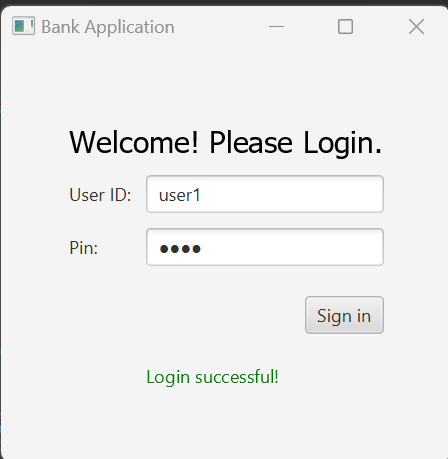
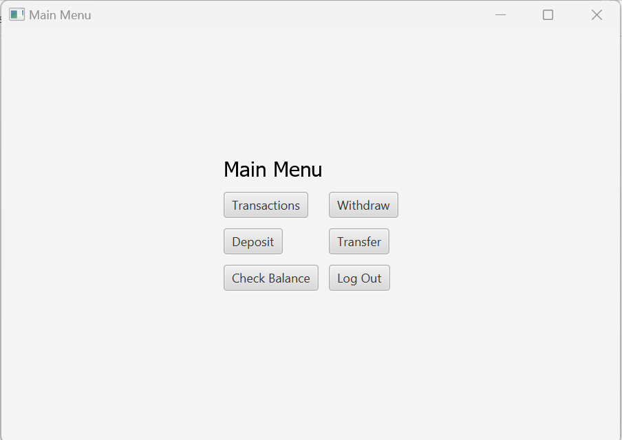
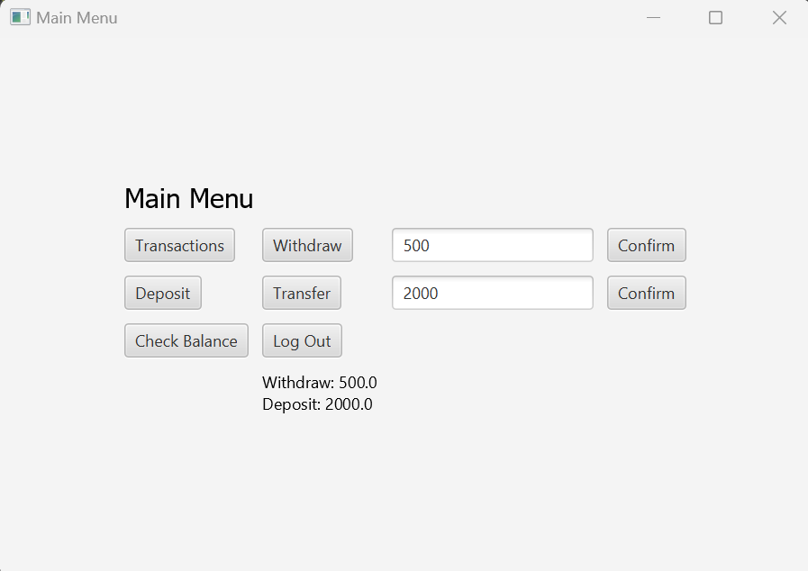

# ATM_Interface 

# Project Details :-

* **Name** - Mock working of a Bank
* **Language Used** - Java
* **Software Used** - JavaFX
* **Author** - Surya Kiran

# Description and Features :- 

This Repository contains a Mini Project of Working of a Bank With Real Time User-Interface. In this mini project, I have tried to make a Real time JavaFX application which will interact with user and collect Login Details, The application will then check the Credentials in a Mock DataBase, (Defined in "AccountService Class"), and if the Credentials match with the ones in the Data Base, then The Login will be Successful else, it will fail. After Successful login, the user can perform numerous actions including Withdrawing the Balance, Deposit balance, Transfer the amount to another user (userID must match in DataBase), View Transactions History. After work, user can log out and log in into other account. 

The bank working model currently runs on JavaFX. We can also make the same for Console Based Application, just by removing the FX part and making some minor changes. 

* To access the Driver class (main method) head over to [this](bank/src/JavaFX_bank_work/Driver.java "Redirects you to Driver Class") path. 

# Add Users in DataBase : - 
Currently the MockDataBase has 2 users to check the working of the Bank Application. To Add more users in DataBase, we have to add "accounts.put("userID", new Account("userID","PIN","NAME",ACC_BALANCE(int) ) ) ; " under AccountService's Constructor. Because the Java code works on HashMap Data Structure, So with this line, we can easily add N number of Data Users. 

# Major Snapshots :- 
# On Successful Login :- 

# Capable Operations :- 

# Transactions Performed History :- 

* For Detailed Snapshots of each Operations, with respective corner case, check out [output_snapshots](output_snapshots/) folder. 

# Note :- 
This JavaFX based application will only work if your IDE is JavaFX compactible.
To Set-up JavaFX in Eclipse follow the steps in this [Youtube Video](https://www.youtube.com/watch?v=H12uPhQ-oyY "This will redirect you to Youtube Video for Java FX Setup in Eclipse")

# Socials :- 

Link                                                                        |
----------------------------------------------------------------------------|
[HackerRank](https://www.hackerrank.com/Surya_15 "My HackerRank Profile")|
[LinkedIn](https://www.linkedin.com/in/surya-kiran-3430b525b/ "My LinkedIn page")    |
[Instagram](https://www.instagram.com/suryaa.kiran/ "My Insta Page, Just in case you wanna follow :p")             |

# Upcoming Features : - 
Please note the following features are NOT yet ready and will be added in near future. 
* Forgot Password
* A dedicated Website which on clicking a button will directly launch the JavaFX application. 
* A dedicated DataBase

